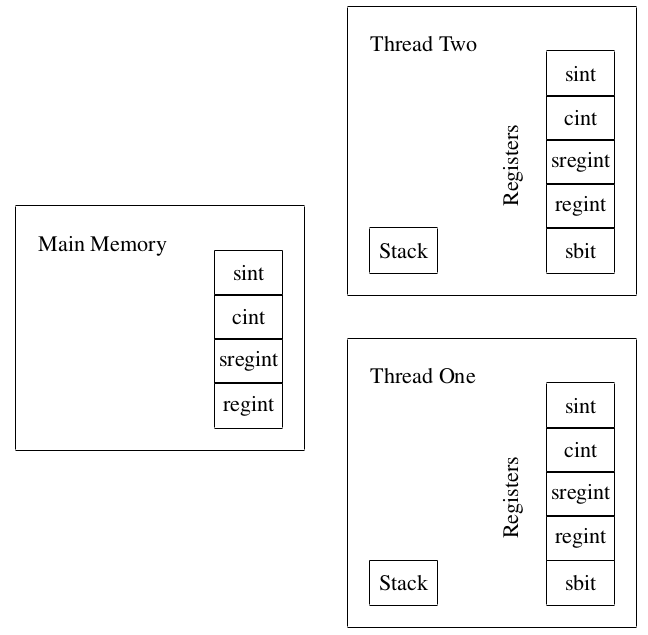

Run Time Subsystem
==================
This chapter describes the implementation of the MPC Virtual Machine.
The virtual machine is driven by byte-codes which are produced by the
MAMBA compiler (see later). Of course you could compile byte-codes
from any compiler if you wanted to write one with the correct backend.

The virtual machine structure resembles that of a simple multi-core
processor, and is a register-based machine. Each core corresponds to a
seperate online thread of execution; so from now on we refer to these
"cores" as threads. Each thread has a seperate set of registers, as
well as a stack for *integer* values. To allow the saving of state, or
the transfer of data between threads, there is a global memory. This
global memory (or at least the first :math:`2^{20}` values) are saved
whenever the SCALE system gracefully shuts down. The loading of this
saved memory into a future run of the system is controlled by the
command line arguments passed to the :file:`Player.x` program. The
design is deliberately kept sparse to ensure a fast, low-level
implementation, whilst more complex optimization decisions are intended
to be handled at a higher level.

Overview
--------
The core of the virtual machine is a set of threads, which
execute sequences of instructions encoded in a byte-code format.
Files of byte-code instructions are referred to as *tapes*,
and each thread processes a single tape at a time.
Each of these execution threads has a pairwise point-to-point
communication channels with the associated threads in all
other players' runtime environments.
These communication channels, like all communication channels
in SCALE, are secured via TLS.
The threads actually have three channels to the corresponding
thread in the other parties; we call these different channels
"connections".
For the online thread "connection" zero is used for standard
opening of shared data, whereas "connection" one is used for
private input and output.
Connection two is used for all data related to aBits, aANDs
and garbled circuit computations.
This division into different connections is to avoid conflicts beween
the three usages (for example a ``PRIVATE_OUTPUT`` coming between
a ``STARTOPEN`` and a ``STOPOPEN``).
Each online thread is supported by four other threads
performing the offline phase, each again with pairwise
TLS secured point-to-point channels. Currently the offline
threads only communicate on "connection" zero.
A single offline thread produces authenticated bits, aBits,
by OT-extension, whilst another produced authenticated
triples for GC operations, so called aANDs.

.. _fig-threads:

.. figure:: _static/threads.png

   Pictorial View of a Players Threads:
   With Two Online Threads and Two FHE Factory Threads

In the case of Full Threshold secret sharing another set of
threads act as a factory for FHE ciphertexts. Actively securing
production of such ciphertexts is expensive, requiring complex
zero-knowledge proofs (see Section :ref:`sec-fhe`). Thus
the FHE-Factory threads locates this production into a
single location. The number of FHE Factory threads can be
controlled at run-time by the user.
See Figure :ref:`fig-threads` for an pictorial overview.

In addition to byte-code files, each program to be run must
have a *schedule*. This is a file detailing the execution
order of the tapes, and which tapes are to be run in parallel.
There is no limit to the number of concurrent tapes specified in
a schedule, but in practice one will be restricted by the number
of cores.
The schedule file allows you to schedule concurrent threads
of execution, it also defines the maximum number of threads
a given run-time system will support. It also defines
the specific byte-code sequences which are pre-loaded
into the system.
One can also programmatically control execution of new
threads using the byte-code instructions ``RUN_TAPE`` and
``JOIN_TAPE`` (see below for details).
The schedule is run by the *control thread*. This thread takes the
tapes to be executed at a given step in the schedule, passes them to
the execution threads, and waits for the threads to finish their
execution before proceeding to the next stage of the schedule.

Communication between threads is handled by a global *main memory*,
which all threads have access to. To avoid unnecessary stalls there is
no locking mechanism provided to the memory. So if two simultaneously
running threads execute a read and a write, or two writes, to the same
memory location then the result is undefined since it is not specified
as to which order the instructions will be performed in.
Memory comes in four forms, corresponding to ``sint``, ``cint``,
``regint`` and ``sregint`` data types. There is no memory for the
``sbit`` datatype, as it is meant only for temporary storage of data.

Each execution thread also has its own local clear and secret
registers, to hold temporary variables. To avoid confusion with the
main memory we refer to these as registers.
The values of registers are not assumed to be maintained between an
execution thread running one tape and the next tape, so all passing of
values between two sequential tape executions must be done by reading
and writing to the virtual machine's main memory. This holds even if
the two consequtive byte-code sequences run  on the same "core".
A pictorial representation of the memory and registers is given in
Figure :ref:`fig-memory`.

.. _fig-memory:

   Pictorial Representation of Memory and Registers:
   With Two Online Threads

Byte-code Instructions
----------------------
The design of the byte-code instructions within a tape are influenced
by the RISC design strategy, coming in only a few basic types and
mostly taking between one and three operands. The virtual machine also
supports a limited form of SIMD instructions within a thread, whereby
a single instruction is used to perform the same operation on a fixed
size set of registers. These vectorized instructions are not executed
in parallel as in traditional SIMD architectures, but exist to provide
a compact way of executing multiple instructions within a thread,
saving on memory and code size.

A complete set of byte-codes and descriptions is given in the html file
in::

   $(HOME)/Documentation/Compiler_Documentation/index.html

under the class ``instructions``.

Each encoded instruction begins with 32 bits reserved for the opcode.
The right-most nine bits specify the instruction to be executed [#]_
The remaining 23 bits are used for vector instructions, specifying the
size of the vector of registers being operated on. The remainder of an
instruction encoding consists of 4-byte operands, which correspond to
either indices of registers or immediate integer values.

.. note:: Vector instructions are not listed in the ``html`` document
   above.

   They have the same name as standard instructions, prefixed by 'V',
   with the opcode created as described above.

The basic syntax used in the above html file is as follows:

c[w]
   clear register :math:`\bmod \; p`, with the optional suffix ``w`` if
   the register is written to.

s[w]
   secret register :math:`\bmod \; p`, and a ``w`` as above.

r[w]
   64-bit signed integer regint register, clear type
   :math:`\bmod \; 2^{64}`, and a ``w`` as above.

sr[w]
   64-bit signed integer secret register :math:`\bmod \; 2^{64}`, and a
   ``w`` as above.

sb[w]
   1 bit boolean secret register, and a ``w`` as above.

i
   32-bit integer signed immediate value.

int
   64-bit integer unsigned immediate value.

p
   32-bit number representing a player index.

str
   A four byte string.

Memory Types
^^^^^^^^^^^^
We can divide the memory registers over which we operate in two main
categories. Registers that use :math:`\bmod \; p` arithmetic, and those
who use :math:`\bmod \; 2^{64}` arithmetic instead. Each of these
categories includes two varieties, one for secret and other for clear
data.  In the case of :math:`\bmod \; p`, these varieties are ``sint``
and ``cint``; and are denoted by ``r[i]``, ``c[i]``. Whereas, for
:math:`\bmod \; 2^{64}`, the varieties are ``sregint`` and ``regint``;
and are denoted by ``sr[i]`` and ``r[i]``.

Load, Store and Memory Instructions
-----------------------------------
Being a RISC design the main operations are load/store operations,
moving operations, and memory operations. Each type of instructions
comes in either clear data, share data, or integer data formats. The
integer data is pure integer arithmetic, say for controlling loops,
whereas clear data could be either integer arithmetic
:math:`\bmod \; p` or :math:`\bmod \; 2^{64}`. For the clear values
:math:`\bmod \; p`, all values represented as integers in the range
:math:`(-\frac{p-1}{2}, \dots, \frac{p-1}{2}]`. Whereas for the 64-bits
clear register values, all of them are represented in the range
:math:`(-2^{63}), \dots, 2^{63})`. There is a stack of ``regint``
values which is mainly intended for loop control. Finally, there are
different set of memory instructions depending on whether they manage
:math:`\bmod \; p` or :math:`\bmod \; 2^{64}` registers, we enumerate
them as follows.

Basic Load/Store/Move :math:`\bmod \; p` Instructions
^^^^^^^^^^^^^^^^^^^^^^^^^^^^^^^^^^^^^^^^^^^^^^^^^^^^^

.. code-block:: asm

   LDI
   LDI
   LDSI
   MOVC
   MOVS

Basic Load/Store/Move :math:`\bmod \; 2^{64}` Instructions
^^^^^^^^^^^^^^^^^^^^^^^^^^^^^^^^^^^^^^^^^^^^^^^^^^^^^^^^^^
We have 2 basic extra instructions for secret types ``LDSIN``,
``MOVSINT``; and two for clear registers ``LDIN``, ``MOVINT``.

Loading to/from Memory in :math:`\bmod \; p`
^^^^^^^^^^^^^^^^^^^^^^^^^^^^^^^^^^^^^^^^^^^^

Loading to/from Memory in :math:`\bmod \; 2^{64}`
^^^^^^^^^^^^^^^^^^^^^^^^^^^^^^^^^^^^^^^^^^^^^^^^^

Accessing the integer stack
^^^^^^^^^^^^^^^^^^^^^^^^^^^

Data Conversion
^^^^^^^^^^^^^^^

Preprocessing Loading Instructions
----------------------------------

Open Instructions
-----------------
There are tailor-made approaches to open registers depending on whether
they are :math:`\bmod \; p` or :math:`\bmod \; 2^{64}`. We detail both
in this section.

Instructions for mod :math:`p` registers
^^^^^^^^^^^^^^^^^^^^^^^^^^^^^^^^^^^^^^^^
The process of opening secret values is covered by two instructions.
The ``STARTOPEN`` instruction takes as input a set of :math:`m` shared
registers, and ``STOPOPEN`` an associated set of :math:`m` clear
registers, where :math:`m` can be an arbitrary integer. This initiates
the protocol to reveal the :math:`m` secret shared register values,
storing the result in the specified clear registers. The reason for
splitting this into two instructions is so that local, independent
operations may be placed between a ``STARTOPEN`` and ``STOPOPEN``,
to be executed whilst waiting for the communication to finish.

Threading Tools
---------------

Basic Arithmetic
----------------

Advanced Arithmetic
-------------------

Debuging Output
---------------

Data Input and Output
---------------------
This is entirely dealt with in the later :ref:`sec-io`. The associated
byte-codes are

.. code-block:: text

             OUTPUT_CLEAR,           INPUT_CLEAR,
             OUTPUT_SHARE,           INPUT_SHARE,
             OUTPUT_INT,             INPUT_INT,
             PRIVATE_INPUT,          PRIVATE_OUTPUT,
             OPEN_CHAN,              CLOSE_CHAN

Branching
---------
Branching is supported by the following instructions: ``JMP``,
``JMPNZ``, ``JMPEQZ``.

Call/Return
-----------
Call and return to subroutines is supported by the following
instructions: ``CALL`` and ``RETURN``.

Comparison Tests for :math:`\bmod \; 2^{64}`
--------------------------------------------

User Defined RunTime Extensions
-------------------------------

Other Commands
--------------

.. rubric:: Footnotes

.. [#] The choice of nine is to enable extension of the system later,
       as eight is probably going to be too small.
