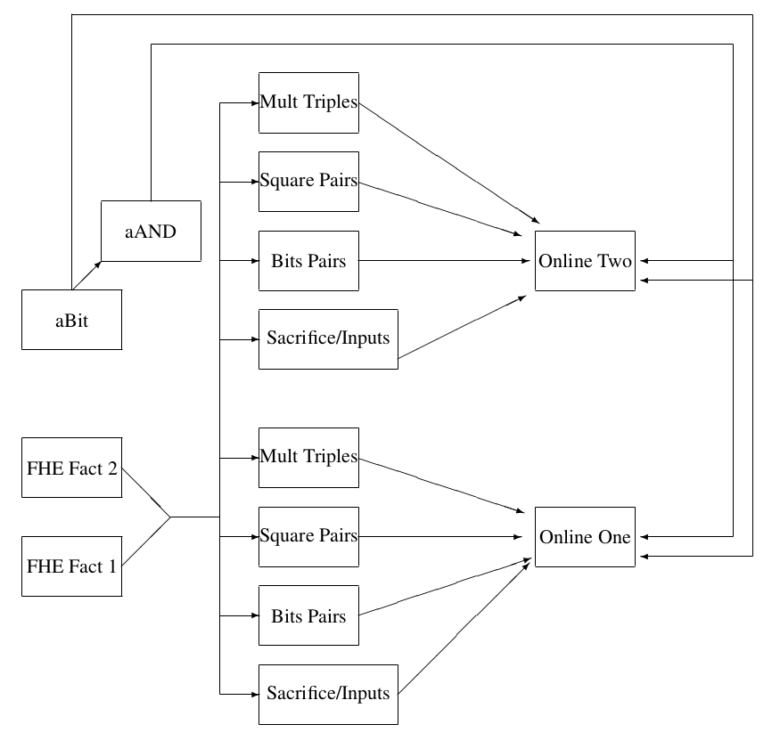

Run Time Subsystem
==================
This chapter describes the implementation of the MPC Virtual Machine.
The virtual machine is driven by byte-codes which are produced by the
MAMBA compiler (see later). Of course you could compile byte-codes
from any compiler if you wanted to write one with the correct backend.

The virtual machine structure resembles that of a simple multi-core
processor, and is a register-based machine. Each core corresponds to a
seperate online thread of execution; so from now on we refer to these
"cores" as threads. Each thread has a seperate set of registers, as
well as a stack for *integer* values. To allow the saving of state, or
the transfer of data between threads, there is a global memory. This
global memory (or at least the first :math:`2^{20}` values) are saved
whenever the SCALE system gracefully shuts down. The loading of this
saved memory into a future run of the system is controlled by the
command line arguments passed to the :file:`Player.x` program. The
design is deliberately kept sparse to ensure a fast, low-level
implementation, whilst more complex optimization decisions are intended
to be handled at a higher level.

Overview
--------

   Pictorial View of a Players Threads:
   With Two Online Threads and Two FHE Factory Threads

Byte-code Instructions
----------------------
The design of the byte-code instructions within a tape are influenced
by the RISC design strategy, coming in only a few basic types and
mostly taking between one and three operands. The virtual machine also
supports a limited form of SIMD instructions within a thread, whereby
a single instruction is used to perform the same operation on a fixed
size set of registers. These vectorized instructions are not executed
in parallel as in traditional SIMD architectures, but exist to provide
a compact way of executing multiple instructions within a thread,
saving on memory and code size.

Memory Types
^^^^^^^^^^^^
We can divide the memory registers over which we operate in two main
categories. Registers that use :math:`\bmod \; p` arithmetic, and those
who use :math:`\bmod \; 2^{64}` arithmetic instead. Each of these
categories includes two varieties, one for secret and other for clear
data.  In the case of :math:`\bmod \; p`, these varieties are ``sint``
and ``cint``; and are denoted by ``r[i]``, ``c[i]``. Whereas, for
:math:`\bmod \; 2^{64}`, the varieties are ``sregint`` and ``regint``;
and are denoted by ``sr[i]`` and ``r[i]``.

Load, Store and Memory Instructions
-----------------------------------

Preprocessing Loading Instructions
----------------------------------

Open Instructions
-----------------
There are tailor-made approaches to open registers depending on whether
they are :math:`\bmod \; p` or :math:`\bmod \; 2^{64}`. We detail both
in this section.

Instructions for mod :math:`p` registers
^^^^^^^^^^^^^^^^^^^^^^^^^^^^^^^^^^^^^^^^
The process of opening secret values is covered by two instructions.
The ``STARTOPEN`` instruction takes as input a set of :math:`m` shared
registers, and ``STOPOPEN`` an associated set of :math:`m` clear
registers, where :math:`m` can be an arbitrary integer. This initiates
the protocol to reveal the :math:`m` secret shared register values,
storing the result in the specified clear registers. The reason for
splitting this into two instructions is so that local, independent
operations may be placed between a ``STARTOPEN`` and ``STOPOPEN``,
to be executed whilst waiting for the communication to finish.

Threading Tools
---------------

Basic Arithmetic
----------------

Advanced Arithmetic
-------------------

Debuging Output
---------------

Data Input and Output
---------------------
This is entirely dealt with in the later :ref:`sec-io`. The associated
byte-codes are

.. code-block:: text

             OUTPUT_CLEAR,           INPUT_CLEAR,
             OUTPUT_SHARE,           INPUT_SHARE,
             OUTPUT_INT,             INPUT_INT,
             PRIVATE_INPUT,          PRIVATE_OUTPUT,
             OPEN_CHAN,              CLOSE_CHAN

Branching
---------
Branching is supported by the following instructions: ``JMP``,
``JMPNZ``, ``JMPEQZ``.

Call/Return
-----------
Call and return to subroutines is supported by the following
instructions: ``CALL`` and ``RETURN``.

Comparison Tests for :math:`\bmod \; 2^{64}`
--------------------------------------------

User Defined RunTime Extensions
-------------------------------

Other Commands
--------------
